# Martín Chancalay | IT Support & Cybersecurity Portfolio

**[English](#english) | [Español](#español)**

---

## English

I'm an IT support and cybersecurity professional based in Argentina (UTC-3), looking for my first formal remote role: IT support (N1/N2), junior SOC analyst (L1) or bilingual customer support. I'm self-taught, so everything here is work I built myself and can walk through step by step in an interview.

Everything here is personal home lab work, not production or client work. Each write-up says so.

- **Target roles:** IT Support / Helpdesk (N1/N2), SOC Analyst (L1) and Customer Support (bilingual English/Spanish)
- **Work mode:** remote, LATAM and international. On-site or hybrid only in Bahía Blanca
- **Languages:** Spanish (native), English (Cambridge FCE, B2)
- **Contact:** [LinkedIn](https://www.linkedin.com/in/martin-chancalay-902b543a8) · [Email](mailto:martinjchancalay@gmail.com) · [GitHub](https://github.com/TinchoLay)

### Projects at a glance

| Project | What it is | Main skills | Closest role |
| --- | --- | --- | --- |
| [SSH Honeypot](https://github.com/TinchoLay/ssh-honeypot) | Decoy SSH, HTTP and FTP server on an Azure VM that logged real attackers | Python, log analysis, threat intel, Flask, Docker, Azure | SOC L1 |
| [Helpdesk Labs](https://github.com/TinchoLay/Helpdesk-labs) | Active Directory domain on Azure with 50 users and 12 documented N1/N2 tickets | Active Directory, GPO, PowerShell, Event Viewer, NTFS/SMB | IT Support N1/N2 |
| [Hash Identifier](https://github.com/TinchoLay/Hash-Identifier) | CLI that tells you what kind of hash a string is, with a confidence ranking | Python, CLI design, pytest (38 tests) | SOC L1 |
| [Hash Cracker](https://github.com/TinchoLay/Hash-Cracker) | CLI dictionary attack that uses every CPU core and imports Hash Identifier | multiprocessing, password security, pytest (41 tests) | SOC L1 / security |
| [Wazuh Detection Pack](https://github.com/TinchoLay/wazuh-detection-pack) | Wazuh lab on AWS with 32 custom detection rules, 28 of them built from the techniques of the TeamTNT threat group and mapped to MITRE ATT&CK. Each rule has a positive test, a negative test and a documented evasion. Three also exist as Sigma rules | Wazuh, auditd, MITRE ATT&CK, Sigma, detection rules, AWS, Linux | SOC L1 |

---

### 1. SSH Honeypot

[Repository](https://github.com/TinchoLay/ssh-honeypot)

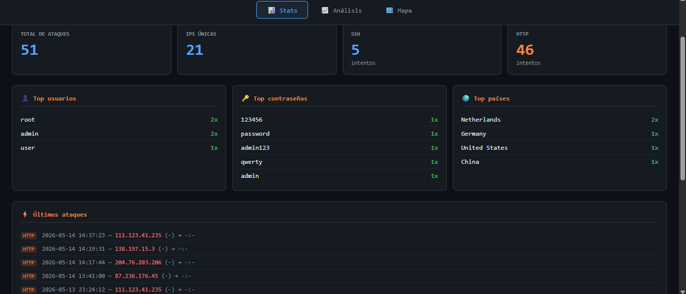

A honeypot is a decoy server. It looks real, accepts connections, and has nothing of value inside. I built one that fakes three services, ran it on an Azure VM exposed to the internet, and logged what real attackers did to it.

#### What it does

- **Three fake services:** SSH (port 2222) with an interactive fake shell that imitates Ubuntu 22.04, an HTTP admin panel styled like a TP-Link router (8080), and an FTP server that rejects every credential (2121).
- **Logging:** every attempt is stored with credentials, geolocation and, on SSH, every command the attacker types.
- **Attacker classification:** a Random Forest model (scikit-learn) sorts attackers into four groups (brute-force bot, scanner, script kiddie, targeted attacker) and retrains itself every 100 attempts.
- **Tool fingerprinting:** it reads the SSH client banner to guess the tool behind the connection, such as Hydra or a home-made script.
- **Malware triage:** when an attacker runs `wget` or `curl`, the honeypot downloads the file in the background, hashes it (MD5, SHA256) and checks the hash on VirusTotal.
- **IP enrichment:** lookups against AbuseIPDB and Shodan, plus email alerts when attempts pass a threshold.
- **Real-time dashboard:** Flask and WebSockets, with stats, time-of-day charts and a world map of attack origins.

#### What I saw once it was exposed

- The first attempts arrived within minutes, with no advertising.
- SSH was quiet in my capture (5 attempts), all with default usernames and weak passwords: `root`, `admin` and `user` with `123456`, `password`, `admin123`, `qwerty` and `admin`.
- HTTP traffic was mostly scanners looking for `/admin`, `/login` and `/wp-admin`.
- The busiest IPs traced back to Tor exit nodes, cloud VPS ranges and Chinese IP blocks.
- The bots were very regular, with millisecond gaps between attempts.

**By the numbers**, from the dashboard:

| | |
| --- | --- |
| Events logged | 58 at the last check |
| Unique IPs | 23 |
| HTTP / SSH | 53 / 5 |
| Countries seen | Netherlands, Germany, United States, China |
| Top usernames | `root`, `admin`, `user` |
| Top passwords | `123456`, `password`, `admin123`, `qwerty`, `admin` |

It is a small sample, but it is real internet traffic, not simulated. Most of it arrived on a single day (May 13, 2026). The screenshots below were taken a little earlier, at 51 events and 21 unique IPs, so their counts are slightly lower.

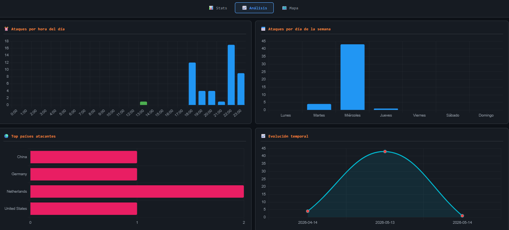

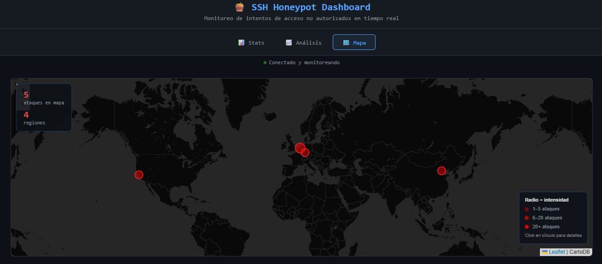

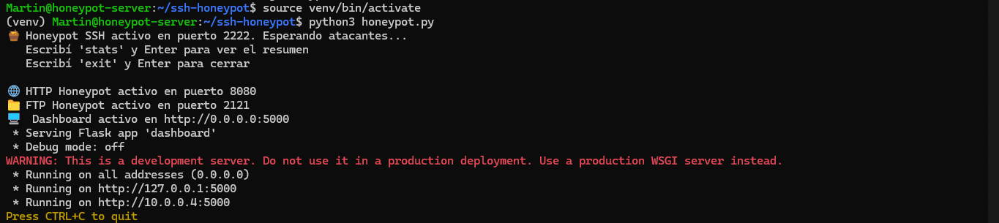

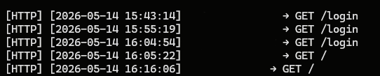

#### What I learned

- How SSH works inside: key negotiation, authentication and channels.
- Raw TCP servers with Python's `socket` module, and session control with paramiko.
- Training a scikit-learn model on data I captured myself, then wiring it into a live system.
- Consuming REST APIs (ip-api, AbuseIPDB, Shodan, VirusTotal).
- Cloud networking on Azure: VM setup and Network Security Group rules.
- The unglamorous production side: running in the background, keeping logs from getting lost, restarting after a crash.

#### Skills shown

Log analysis, attacker profiling, threat intelligence enrichment, brute-force pattern recognition, malware hash triage, Python, Flask, Docker, Azure.

This is the closest thing to L1 triage in my portfolio: spot the activity, enrich the IP, classify it, write it down. The honeypot only captures traffic aimed at a server that I own.

---

### 2. Helpdesk Labs

[Repository](https://github.com/TinchoLay/Helpdesk-labs)

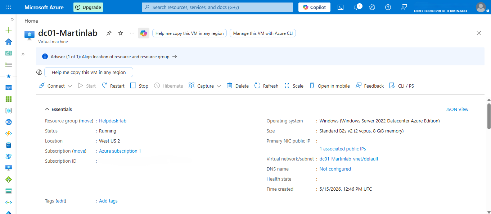

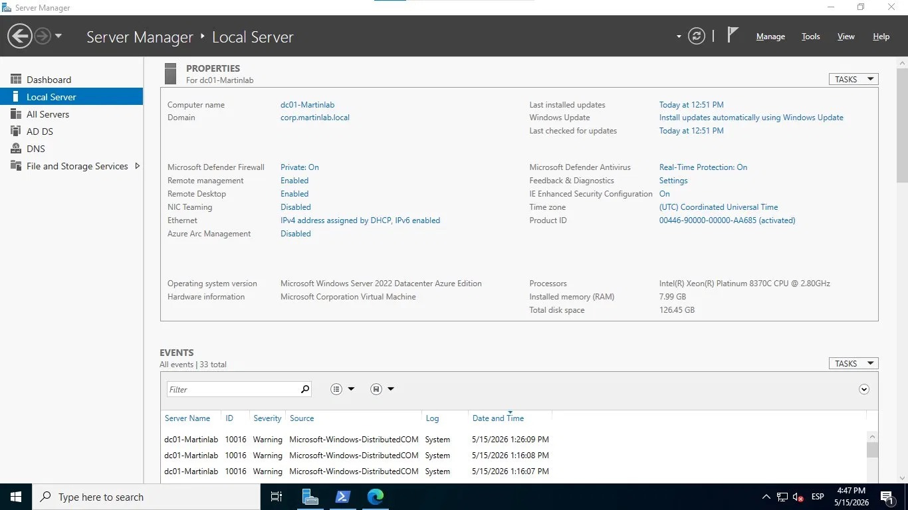

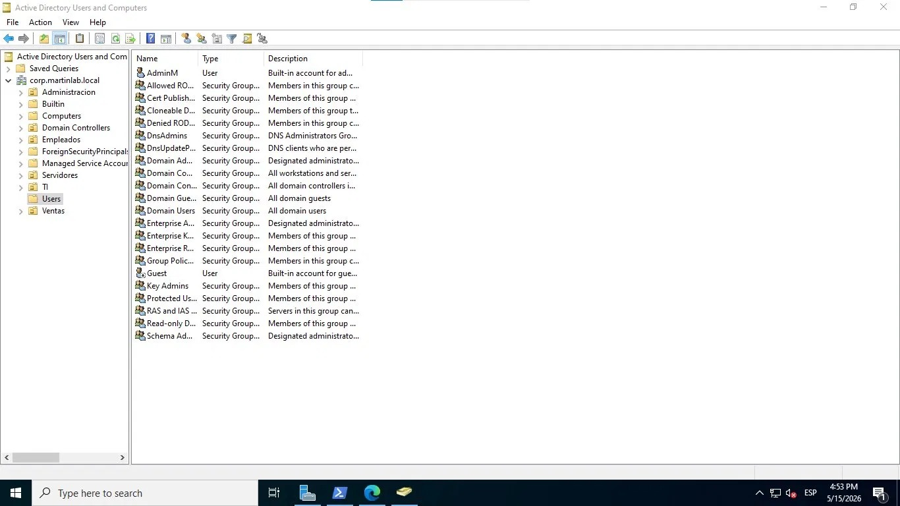

The Azure free trial has ended, so the VM no longer exists. These captures are what remains of the running environment.

An Active Directory environment on Azure, built to practice the problems an N1/N2 technician handles every day in a mid-sized company.

#### Environment

| Component | Detail |
| --- | --- |
| Cloud | Microsoft Azure |
| Server | Windows Server 2022 Datacenter Azure Edition (Standard B2s_v2, 2 vCPU, 8 GiB RAM) |
| Domain | corp.martinlab.local, controller `dc01-Martinlab` |
| Users | 50, split across IT, Sales and Administration |

#### What I did

- Deployed the domain controller on Azure and wrote three setup guides: the VM, the domain controller, and users, OUs and GPOs.
- Created the 50 users in bulk with PowerShell, distributed across OUs and groups.
- Resolved and documented 12 tickets. The four N1 tickets cover a locked-out user, a password reset with forced change, new user onboarding and an expired account. The eight N2 tickets cover:
  - a broken GPO diagnosed with `gpresult`
  - a folder access problem where NTFS and share permissions disagreed
  - delegated control with restricted rights for a junior technician
  - a slow login caused by a startup script GPO
  - after-hours logon detection through security event logs
  - a brute-force simulation and the lockout policy response
  - a full AD audit of inactive users and expired passwords
  - an accidental deletion restored from the AD Recycle Bin
- Wrote three PowerShell scripts: bulk user creation, an account audit that exports inactive, disabled and expired accounts to CSV, and a lockout report built on security events 4625 and 4740.
- Added screenshots for every exercise.

#### What I learned

- Reading the Windows Security log to trace where a lockout comes from.
- Diagnosing a GPO with `gpresult` before touching anything.
- Why a user can have share access and still be denied: the effective permission depends on both NTFS and the share.
- Delegating only the rights a junior technician needs.
- Writing a ticket so the next person can understand what happened and why.

#### Skills shown

Active Directory, Group Policy, PowerShell, Event Viewer and security event analysis, NTFS and SMB permissions, AD ACL delegation, AD Recycle Bin recovery, ticket documentation, Windows Server 2022, Azure VMs.

---

### 3. Hash Identifier

[Repository](https://github.com/TinchoLay/Hash-Identifier)

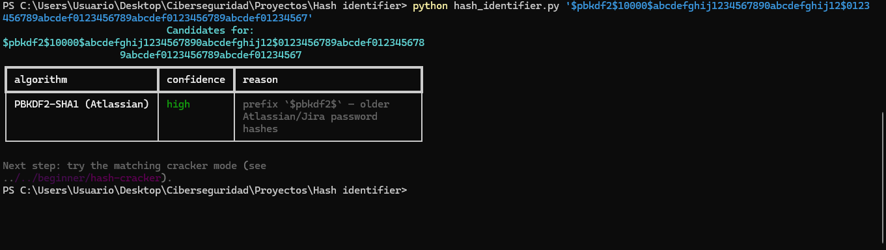

A command-line tool (`hashid`) that looks at a string and lists every algorithm it could be, ranked by confidence, with the reason for each. It recognizes bcrypt, MD5, SHA-256, JWT, Cisco passwords, blockchain addresses and more.

#### What it does

- Three modes: `identify` (one hash), `batch` (a file with one hash per line) and `interactive`.
- Output as a color-coded table, JSON or CSV, so results can go into a script, a spreadsheet or a SIEM.
- When it can't be sure, it says so. MD5 and NTLM produce the same length, so the tool returns both instead of pretending to know.

#### How it's built

Each hash format has its own small `Detector` class, and an engine runs all of them against the input. Adding a format means writing one class instead of editing a long if/elif function. I chose this design on purpose so I could explain it. 38 automated tests cover every detector and the CLI. Python 3.11+, managed with `uv`, MIT licensed.

#### What I learned

- Designing a tool around small, single-purpose classes and being able to defend the trade-off.
- Documenting bugs and how I tracked them down. The full session log is in the repo.
- A Windows detail that cost me a session: PowerShell treats `$` inside double quotes as a variable, so hashes that start with `$` must go in single quotes.

#### Skills shown

Python, CLI design, testing with pytest, hash algorithms and formats, technical documentation.

The idea started from the `hash-identifier` learning module in CarterPerez-dev's Cybersecurity-Projects. The architecture and the code are my own.

---

### 4. Hash Cracker

[Repository](https://github.com/TinchoLay/Hash-Cracker)

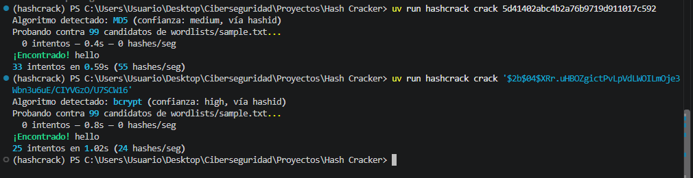

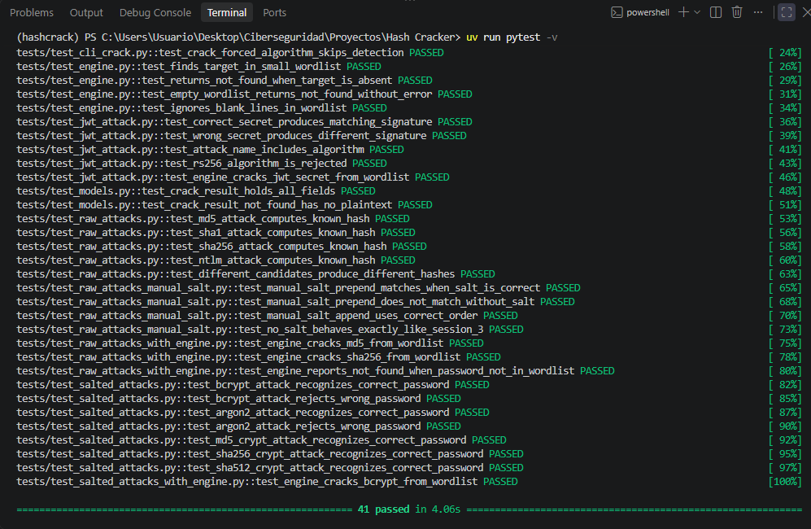

A command-line tool (`hashcrack`) that takes a hash and a wordlist and looks for the word that produced it, using every CPU core. It is the companion of Hash Identifier and imports it as a real Git dependency, so it detects the algorithm by itself.

#### What it does

- **Dictionary attack** on MD5, SHA-1, SHA-256, NTLM, bcrypt, Argon2 and three Unix crypt variants.
- **Instant reversal** of Cisco Type 7, which is a reversible cipher and not a real hash.
- **JWT secret search**, aimed at the key the server used to sign the token.
- Options for custom wordlists, manual salts and forcing the algorithm when detection is ambiguous.

#### How it's built

Two small interfaces, `Attack` and `Reverser`, sit under everything, and each algorithm is its own class. The search runs on `multiprocessing` instead of `threading`, because Python's GIL stops threads from doing CPU-heavy work in parallel. One bug worth telling in an interview: my first version tried to share a `multiprocessing.Event` through the pool's task queue and failed with a `RuntimeError`. The fix was to pass the shared objects through the pool's `initializer`. 41 automated tests, MIT licensed.

#### Skills shown

Python concurrency (`multiprocessing`), password security concepts, interface design, dependency management between projects, testing with pytest.

Use it only on hashes you own or have explicit permission to test. The idea started from the `hash-cracker` module in CarterPerez-dev's Cybersecurity-Projects, and I built it with a different architecture and no reused code.

---

### 5. Wazuh Detection Pack

[Repository](https://github.com/TinchoLay/wazuh-detection-pack)

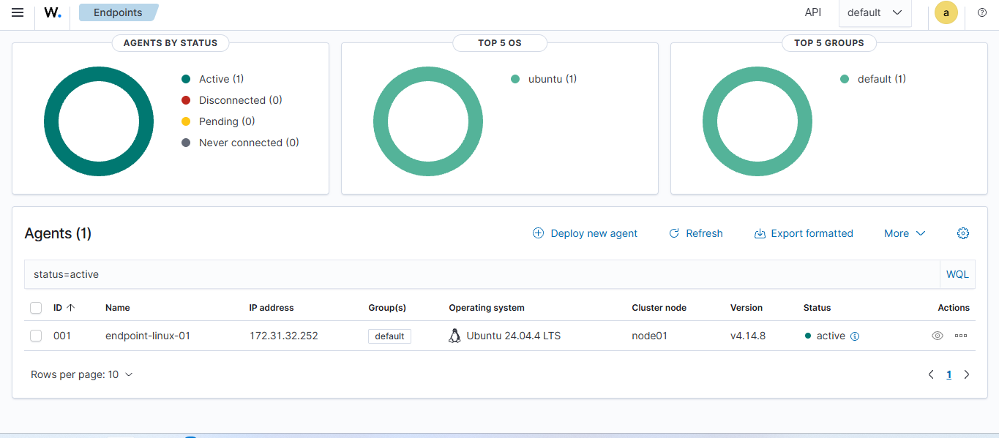

A home lab where I practice the detection engineering workflow on Wazuh, an open source SIEM and XDR platform. I read what an adversary does, write a rule for it, check that the rule fires, check that it stays quiet on normal activity, and write down how it can be evaded. It has two phases: the first built the infrastructure and four rules, and the second wrote 28 more from the techniques of a real threat group, TeamTNT.

#### Environment

| Component | Detail |
| --- | --- |
| Cloud | AWS, us-east-1 |
| Server | Ubuntu Server 24.04 LTS, t3.xlarge (4 vCPU, 16 GB), Wazuh 4.14.8 all-in-one |
| Endpoint | Ubuntu Server 24.04 LTS with the Wazuh agent and auditd, named `endpoint-linux-01` |
| Network | SSH and the dashboard only from my ISP's `/24` block. The agent talks to the server over its private IP |

#### What I did

Phase 1, infrastructure and first rules:

- Deployed Wazuh on AWS with a budget alert set before launching anything, and enrolled a Linux endpoint.
- Configured auditd to record every command my user runs, and told the agent to read the audit log.
- Wrote four custom rules mapped to MITRE ATT&CK. Rule 100100 flags user discovery commands (`whoami`, `id`, `w`, `who`, T1033). Rule 100101 flags copying those binaries, the first step of renaming one (T1036.003). Rule 100102 flags any binary executed from `/tmp`, `/var/tmp` or `/dev/shm` (T1036.003). Rule 100103 lowers the noise from SSH login scripts to level 3 instead of silencing it.
- Tested each rule with a positive case, a negative case and an evasion. A "does not fire" only counted after I checked Wazuh's stock rule 80792 to confirm the event had reached the server.

Phase 2, TeamTNT (ATT&CK G0139):

- Chose TeamTNT because it goes after Linux and cloud workloads, which is what auditd on a Linux box can actually see. The technique list comes from the ATT&CK group page and Unit 42's analysis of the Hildegard campaign. The repo also lists the behaviors my lab cannot see.
- Wrote 28 rules for 10 techniques: tools downloaded with `curl` and `wget` (T1105), cloud credentials read from the instance metadata service (T1552.005), scanners and `tmate` (T1046, T1219), firewall changes, `chattr` and new local accounts, changes to `authorized_keys`, systemd services, `/etc/ld.so.preload`, log deletion and shell history deletion.
- For each technique I wrote down what I expected before testing, then ran a positive test, a negative test with a control and at least one evasion, and wrote a v2 for the evasions I could close. When a prediction was wrong, I kept it in the write-up.
- Built an ATT&CK Navigator layer with a script that reads the `<mitre>` tags from the rules file, so the map cannot drift from the rules. It marks 17 techniques.
- Rewrote three detections as vendor-neutral Sigma rules, after searching SigmaHQ to see what already existed. `sigma check` reports no errors and I converted them to Splunk and Elasticsearch queries. I did not run those queries on a live Splunk or Elastic.
- Validated every change with `wazuh-analysisd -t` before restarting the manager, and used `wazuh-logtest` to see how Wazuh decodes an event whenever a rule misbehaved.

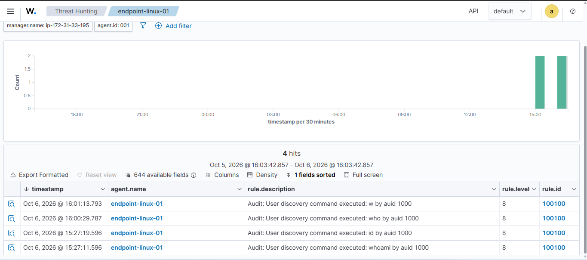

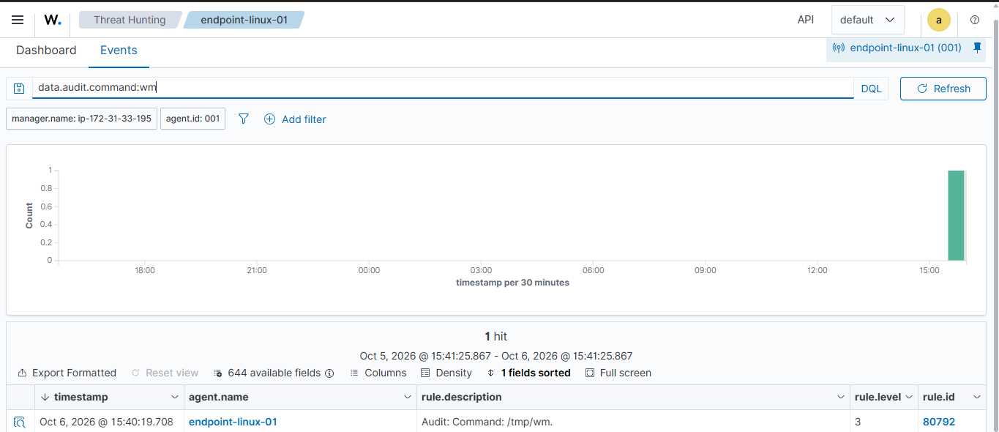

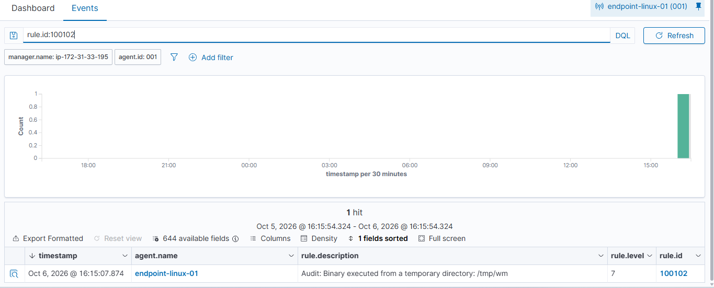

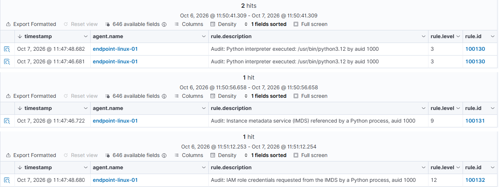

#### What I found

From phase 1:

- My first version of rule 100100 missed `w` and `who`. The official T1033 page lists them for Linux, and I only noticed because I went back to the source.
- Renaming a binary defeats a rule that matches the command name. For a copy of `whoami` saved as `/tmp/wm`, the alert has `audit.command` set to `wm`, but `audit.exe` still shows the full path. That is why rule 100102 matches on the path.
- Wazuh and ATT&CK disagree on how to describe T1036.003: Wazuh calls it "Rename System Utilities" under Defense Evasion, while attack.mitre.org calls it "Rename Legitimate Utilities" under Stealth. My guess, which I have not verified, is that Wazuh ships an older ATT&CK dataset. The ID matches, so I map by ID and never by name.

From phase 2:

- Wazuh's own ruleset has a rule at level 0 (92600) that hides every Python execution. I found it because the event was in the audit log and never reached the dashboard. Rule 100130 brings those events back. That matters because credential theft from the metadata service can be done in Python, and `ufw` is itself a Python script.
- When two sibling rules matched the same event, the one with the higher level won. I had assumed the first one in the file would. That is two observations: I did not read the engine's code and I did not test ties.
- An audit watch on a path is really a watch on an inode. If `~/.ssh` is moved away and a new one is created, the watch keeps pointing at the old one and writes to the new `authorized_keys` go unlogged. I could not repair that with a rule, so I wrote rules for its two fingerprints: the move and the vanished watch.
- `systemctl enable` was invisible to my file watch because systemd (PID 1) creates the symlink, not the command. Adding `audit=1` to the kernel command line and rebooting fixed it. The explanation is my reading of the evidence, and I did not check the kernel documentation.
- A dashboard filter hid an alert, and I called it a detection gap before checking by rule ID. `wazuh-logtest` fixed the diagnosis. Since then I filter by `rule.id`.
- ATT&CK v19 revoked three technique IDs that my rules use. The Navigator layer uses the new ones. The rules still carry the old ones, because I have not tested whether Wazuh accepts the new IDs.

#### What I learned

- How a detection is built from raw telemetry up: auditd, the agent, a stock base rule, then my own rule on top.
- Why the rule uses `auid` and not `uid`: `auid` is the login user and survives `sudo`.
- A negative result means nothing without a control that proves the event arrived.
- Writing down what a rule misses is part of the job, not an admission of failure.
- Detection content needs maintenance. The telemetry, the platform's own ruleset and the ATT&CK taxonomy all change underneath the rules.
- Moving a rule to Sigma forces you to separate the idea of the detection from the Wazuh plumbing around it.
- A lost event is a detection that cannot exist. `auditctl -s` showed 61 lost events at boot until I raised the audit backlog, so now I check that counter.
- Keeping cloud costs under control: budget first, stop instances between sessions, use the private IP so the setup survives a restart.

#### Skills shown

Wazuh rule writing and testing (`wazuh-logtest`), auditd, MITRE ATT&CK mapping and Navigator layers, Sigma, threat group research, Linux log analysis, AWS EC2 and security groups.

It is still a small lab: 32 rules, one endpoint and only my own commands, so I have not measured a false positive rate. A colored cell in the ATT&CK map means I wrote and tested a rule for that technique, not that the technique is covered, and every rule has evasions written down in the repo's limits sections. The README also lists hypotheses I have not tested yet. Next is a rule for the old Wazuh API vulnerability (CVE-2025-24016), after I read the original report. I used an AI assistant as a guide while building it and checked its claims against the Wazuh documentation, attack.mitre.org and my own tests.

---

### 6. Remote support practice (AnyDesk)

A short exercise on the tooling side of N1 work: reaching a user's machine remotely. It is small, and I list it as such.

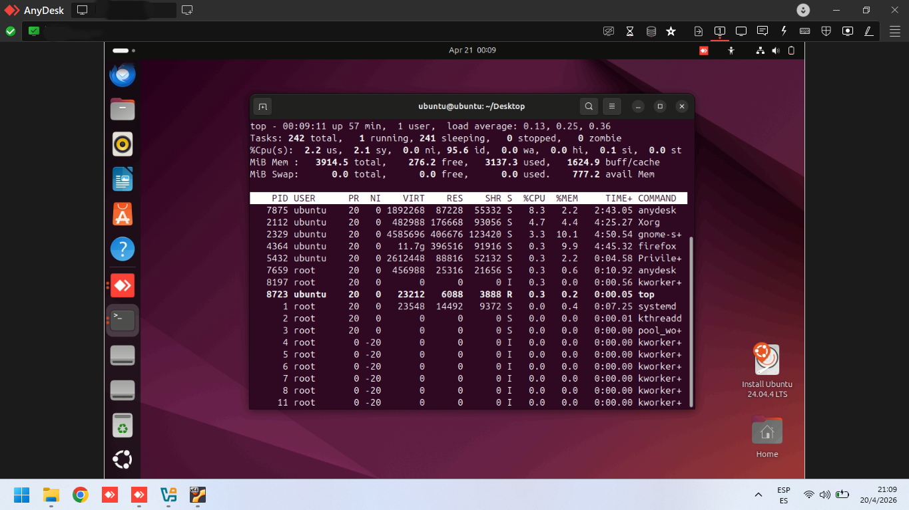

#### What I did

- Installed AnyDesk (`.deb` package) on an Ubuntu 24.04 machine and connected to it from my Windows PC.
- Sent a test file from Windows to `/home/ubuntu` with AnyDesk's file transfer.
- Opened a terminal in the remote session and ran `top` to read CPU, memory and the process list.

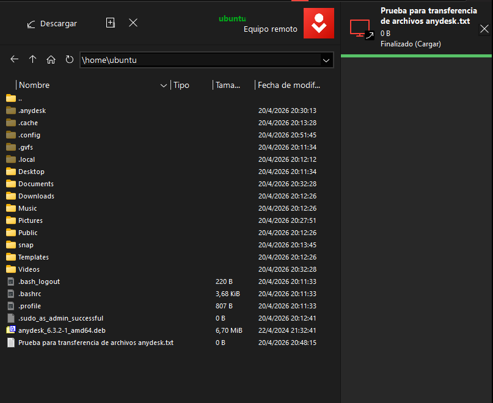

#### Skills shown

Remote support tools, file transfer to a user's machine, first-look performance checks on Linux.

---

### Skills at a glance

| Area | Skills | Where to see it |
| --- | --- | --- |
| IT support | Active Directory, Group Policy, PowerShell, Event Viewer, NTFS/SMB, Windows Server 2022, ticket documentation, remote support with AnyDesk | Helpdesk Labs, remote support practice |
| Security | Log analysis, detection rule writing and testing, MITRE ATT&CK mapping, Sigma rules, brute-force detection, threat intel enrichment, malware hash triage, password and hash analysis | SSH Honeypot, Wazuh Detection Pack, Hash tools, Helpdesk Labs (T009, T010) |
| Development | Python, PowerShell, Flask, Docker, Git, pytest, scikit-learn | All projects |
| Cloud | Azure VMs and network security rules, AWS EC2 and security groups (hands-on), AWS fundamentals and security engineering (coursework) | SSH Honeypot, Helpdesk Labs, Wazuh Detection Pack, AWS certificates |

### Certifications and training

- Cisco Junior Cybersecurity Analyst Career Path
- Cisco: Introduction to Cybersecurity (Mar 2026), Networking Basics (Apr 2026), Python Essentials 1 (Mar 2026)
- ISC2 Candidate, Certified in Cybersecurity (Apr 2026 to Apr 2027)
- AWS (Sep 2026): Technical Essentials, Cloud Essentials, Digital Classroom Security Engineering on AWS, and two Cloud Ops learning paths (Centralized Operations Management, Configuration, Compliance and Auditing; Provisioning and Orchestration)
- Professional Cybersecurity Fundamentals, Microsoft and LinkedIn Learning (Sep 2026)
- SOC (Security Operations Center) course, 3.7h, and Digital Forensics course, 3.3h (Sep 2026)
- HubSpot Service Hub Software Certification (valid Sep 2026 to Oct 2027)
- ServiceNow Micro-Certification: Welcome to ServiceNow (Apr 2026)
- Cambridge First Certificate in English, B2 (Jan 2020)

### Work background

- **Family home appliance store, Casa Martínez (2019 to present, part-time):** diagnosing and repairing TVs, PCs and phones, installing Windows, and dealing with customers directly.
- **Freelance English-Spanish translator on Upwork (Jan to Jun 2026):** personal, academic and certified documents.

### Contact

Open to remote roles in IT support (N1/N2), junior SOC analyst (L1) and customer support, full-time or contract.

[LinkedIn](https://www.linkedin.com/in/martin-chancalay-902b543a8) · [martinjchancalay@gmail.com](mailto:martinjchancalay@gmail.com) · [GitHub](https://github.com/TinchoLay)

---

## Español

Soy profesional de soporte IT y ciberseguridad, vivo en Argentina (UTC-3) y busco mi primer puesto formal remoto: soporte IT (N1/N2), analista SOC junior (L1) o customer support bilingüe. Soy autodidacta, así que todo lo que hay acá lo armé yo y lo puedo explicar paso a paso en una entrevista.

Todo lo que hay acá es trabajo personal de laboratorio, no trabajo de producción ni de clientes. Cada proyecto lo aclara en su descripción.

- **Roles objetivo:** IT Support / Helpdesk (N1/N2), Analista SOC (L1) y Customer Support (bilingüe inglés/español)
- **Modalidad:** remoto, LATAM e internacional. Presencial o híbrido solo en Bahía Blanca
- **Idiomas:** español (nativo), inglés (Cambridge FCE, B2)
- **Contacto:** [LinkedIn](https://www.linkedin.com/in/martin-chancalay-902b543a8) · [Email](mailto:martinjchancalay@gmail.com) · [GitHub](https://github.com/TinchoLay)

### Proyectos de un vistazo

| Proyecto | Qué es | Habilidades principales | Rol más cercano |
| --- | --- | --- | --- |
| [SSH Honeypot](https://github.com/TinchoLay/ssh-honeypot) | Servidor señuelo SSH, HTTP y FTP en una VM de Azure que registró atacantes reales | Python, análisis de logs, threat intel, Flask, Docker, Azure | SOC L1 |
| [Helpdesk Labs](https://github.com/TinchoLay/Helpdesk-labs) | Dominio de Active Directory en Azure con 50 usuarios y 12 tickets N1/N2 documentados | Active Directory, GPO, PowerShell, Visor de eventos, NTFS/SMB | IT Support N1/N2 |
| [Hash Identifier](https://github.com/TinchoLay/Hash-Identifier) | CLI que dice qué tipo de hash es un texto, con ranking de confianza | Python, diseño de CLI, pytest (38 tests) | SOC L1 |
| [Hash Cracker](https://github.com/TinchoLay/Hash-Cracker) | CLI de ataque por diccionario que usa todos los núcleos y depende de Hash Identifier | multiprocessing, seguridad de contraseñas, pytest (41 tests) | SOC L1 / seguridad |
| [Wazuh Detection Pack](https://github.com/TinchoLay/wazuh-detection-pack) | Laboratorio de Wazuh en AWS con 32 reglas de detección propias, 28 de ellas armadas a partir de las técnicas del grupo de amenaza TeamTNT y mapeadas a MITRE ATT&CK. Cada regla tiene una prueba positiva, una negativa y una evasión documentada. Tres existen también como reglas Sigma | Wazuh, auditd, MITRE ATT&CK, Sigma, reglas de detección, AWS, Linux | SOC L1 |

---

### 1. SSH Honeypot

[Repositorio](https://github.com/TinchoLay/ssh-honeypot)

Un honeypot es un servidor señuelo. Parece real, acepta conexiones y no tiene nada de valor adentro. Armé uno que simula tres servicios, lo dejé corriendo en una VM de Azure expuesta a internet y registré lo que hicieron atacantes reales.

#### Qué hace

- **Tres servicios falsos:** SSH (puerto 2222) con una shell interactiva falsa que imita Ubuntu 22.04, un panel de administración HTTP con pinta de router TP-Link (8080) y un FTP que rechaza todas las credenciales (2121).
- **Registro:** cada intento queda guardado con credenciales, geolocalización y, en SSH, cada comando que el atacante tipea.
- **Clasificación de atacantes:** un modelo Random Forest (scikit-learn) los separa en cuatro grupos (bot de fuerza bruta, scanner, script kiddie, atacante dirigido) y se reentrena solo cada 100 intentos.
- **Fingerprinting de herramientas:** lee el banner del cliente SSH para adivinar qué herramienta hay detrás de la conexión, como Hydra o un script casero.
- **Triage de malware:** cuando el atacante corre `wget` o `curl`, el honeypot descarga el archivo en segundo plano, calcula su hash (MD5, SHA256) y lo consulta en VirusTotal.
- **Enriquecimiento de IPs:** consultas a AbuseIPDB y Shodan, más alertas por email cuando los intentos pasan un umbral.
- **Dashboard en tiempo real:** Flask y WebSockets, con estadísticas, gráficos por hora del día y un mapa mundial con el origen de los ataques.

#### Qué vi una vez expuesto a internet

- Los primeros intentos llegaron en minutos, sin publicitar nada.
- SSH estuvo tranquilo en mi captura (5 intentos), todos con usuarios por defecto y contraseñas débiles: `root`, `admin` y `user` con `123456`, `password`, `admin123`, `qwerty` y `admin`.
- El tráfico HTTP venía sobre todo de scanners buscando `/admin`, `/login` y `/wp-admin`.
- Las IPs más activas salían de nodos de salida de Tor, VPS de proveedores cloud y bloques de IP chinos.
- Los bots eran muy regulares, con milisegundos entre intento e intento.

**En números**, según el dashboard:

| | |
| --- | --- |
| Eventos registrados | 58 en la última revisión |
| IPs únicas | 23 |
| HTTP / SSH | 53 / 5 |
| Países vistos | Países Bajos, Alemania, Estados Unidos, China |
| Usuarios más probados | `root`, `admin`, `user` |
| Contraseñas más probadas | `123456`, `password`, `admin123`, `qwerty`, `admin` |

Es una muestra chica, pero es tráfico real de internet, no simulado. Casi todo llegó en un solo día (13 de mayo de 2026). Las capturas de abajo son un poco anteriores, con 51 eventos y 21 IPs únicas, por eso sus números son algo menores.

#### Qué aprendí

- Cómo funciona SSH por dentro: negociación de claves, autenticación y canales.
- Servidores TCP crudos con `socket` en Python y control de sesiones con paramiko.
- Entrenar un modelo de scikit-learn con datos que capturé yo mismo e integrarlo a un sistema en vivo.
- Consumir APIs REST (ip-api, AbuseIPDB, Shodan, VirusTotal).
- Redes en la nube con Azure: armado de la VM y reglas del Network Security Group.
- La parte poco glamorosa de producción: correr en segundo plano, que no se pierdan los logs y reiniciar después de una caída.

#### Habilidades demostradas

Análisis de logs, perfilado de atacantes, enriquecimiento con threat intelligence, reconocimiento de patrones de fuerza bruta, triage de malware por hash, Python, Flask, Docker, Azure.

Es lo más parecido al triage de un L1 que tengo en el portafolio: detectar la actividad, enriquecer la IP, clasificarla y dejarla documentada. El honeypot solo captura tráfico dirigido a un servidor que es mío.

---

### 2. Helpdesk Labs

[Repositorio](https://github.com/TinchoLay/Helpdesk-labs)

La prueba gratuita de Azure terminó, así que la VM ya no existe. Estas capturas son lo que queda del entorno funcionando.

Un entorno de Active Directory en Azure, armado para practicar los problemas que un técnico N1/N2 atiende todos los días en una empresa mediana.

#### Entorno

| Componente | Detalle |
| --- | --- |
| Nube | Microsoft Azure |
| Servidor | Windows Server 2022 Datacenter Azure Edition (Standard B2s_v2, 2 vCPU, 8 GiB RAM) |
| Dominio | corp.martinlab.local, controlador `dc01-Martinlab` |
| Usuarios | 50, repartidos entre TI, Ventas y Administración |

#### Qué hice

- Desplegué el controlador de dominio en Azure y escribí tres guías de instalación: la VM, el controlador de dominio, y usuarios, OUs y GPOs.
- Creé los 50 usuarios en lote con PowerShell, distribuidos en OUs y grupos.
- Resolví y documenté 12 tickets. Los cuatro N1 cubren un usuario bloqueado, un reseteo de contraseña con cambio forzado, el alta de un usuario nuevo y una cuenta vencida. Los ocho N2 cubren:
  - un GPO roto diagnosticado con `gpresult`
  - un problema de acceso a carpeta donde NTFS y el recurso compartido no coincidían
  - delegación de control con permisos restringidos para un técnico junior
  - un login lento causado por un script de inicio por GPO
  - detección de logins fuera de horario a través de los logs de eventos de seguridad
  - una simulación de fuerza bruta y la respuesta de la política de bloqueo
  - una auditoría completa de AD con usuarios inactivos y contraseñas vencidas
  - un borrado accidental recuperado desde la papelera de reciclaje de AD
- Escribí tres scripts de PowerShell: creación de usuarios en lote, una auditoría que exporta a CSV las cuentas inactivas, deshabilitadas y vencidas, y un reporte de bloqueos basado en los eventos de seguridad 4625 y 4740.
- Agregué capturas de cada ejercicio.

#### Qué aprendí

- Leer el log de seguridad de Windows para rastrear de dónde viene un bloqueo.
- Diagnosticar un GPO con `gpresult` antes de tocar nada.
- Por qué un usuario puede tener acceso al recurso compartido y aun así recibir acceso denegado: el permiso efectivo depende de NTFS y del recurso compartido.
- Delegar solo los permisos que un técnico junior necesita.
- Escribir un ticket para que la próxima persona entienda qué pasó y por qué.

#### Habilidades demostradas

Active Directory, Group Policy, PowerShell, Visor de eventos y análisis de eventos de seguridad, permisos NTFS y SMB, delegación de ACLs en AD, recuperación con la papelera de AD, documentación de tickets, Windows Server 2022, VMs en Azure.

---

### 3. Hash Identifier

[Repositorio](https://github.com/TinchoLay/Hash-Identifier)

Una herramienta de línea de comandos (`hashid`) que mira un texto y lista todos los algoritmos que podría ser, ordenados por confianza y con el motivo de cada uno. Reconoce bcrypt, MD5, SHA-256, JWT, contraseñas de Cisco, direcciones de blockchain y más.

#### Qué hace

- Tres modos: `identify` (un hash), `batch` (un archivo con un hash por línea) e `interactive`.
- Salida en tabla con colores, JSON o CSV, para llevar los resultados a un script, una planilla o un SIEM.
- Cuando no está seguro, lo dice. MD5 y NTLM producen el mismo largo, así que devuelve los dos en vez de hacerse el seguro.

#### Cómo está construido

Cada formato de hash tiene su propia clase `Detector` chica, y un motor corre todas contra el texto. Agregar un formato es escribir una clase, no editar una función larga de if/elif. Elegí este diseño a propósito para poder explicarlo. 38 tests automáticos cubren cada detector y la CLI. Python 3.11+, gestionado con `uv`, licencia MIT.

#### Qué aprendí

- Diseñar una herramienta con clases chicas de una sola responsabilidad y poder defender el trade-off.
- Documentar los bugs y cómo los rastreé. La bitácora completa de sesiones está en el repo.
- Un detalle de Windows que me costó una sesión entera: PowerShell trata el `$` dentro de comillas dobles como una variable, así que los hashes que empiezan con `$` van entre comillas simples.

#### Habilidades demostradas

Python, diseño de CLI, testing con pytest, algoritmos y formatos de hash, documentación técnica.

La idea partió del módulo `hash-identifier` de Cybersecurity-Projects de CarterPerez-dev. La arquitectura y el código son míos.

---

### 4. Hash Cracker

[Repositorio](https://github.com/TinchoLay/Hash-Cracker)

Una herramienta de línea de comandos (`hashcrack`) que toma un hash y un diccionario y busca la palabra que lo generó, usando todos los núcleos de la CPU. Es la compañera de Hash Identifier y la importa como una dependencia real de Git, así que detecta el algoritmo sola.

#### Qué hace

- **Ataque por diccionario** sobre MD5, SHA-1, SHA-256, NTLM, bcrypt, Argon2 y tres variantes de crypt de Unix.
- **Reversión instantánea** de Cisco Type 7, que es un cifrado reversible y no un hash real.
- **Búsqueda de la clave de un JWT**, apuntada al secreto que el servidor usó para firmar el token.
- Opciones para diccionarios propios, sales manuales y forzar el algoritmo cuando la detección es ambigua.

#### Cómo está construido

Dos interfaces chicas, `Attack` y `Reverser`, sostienen todo, y cada algoritmo es su propia clase. La búsqueda corre sobre `multiprocessing` y no sobre `threading`, porque el GIL de Python impide que los hilos hagan trabajo de CPU en paralelo. Un bug que vale la pena contar en una entrevista: mi primera versión intentó compartir un `multiprocessing.Event` por la cola de tareas del pool y falló con un `RuntimeError`. La solución fue pasar los objetos compartidos por el `initializer` del pool. 41 tests automáticos, licencia MIT.

#### Habilidades demostradas

Concurrencia en Python (`multiprocessing`), conceptos de seguridad de contraseñas, diseño de interfaces, manejo de dependencias entre proyectos, testing con pytest.

Usala solo contra hashes que sean tuyos o para los que tengas permiso explícito. La idea partió del módulo `hash-cracker` de Cybersecurity-Projects de CarterPerez-dev, y lo construí con otra arquitectura y sin código reutilizado.

---

### 5. Wazuh Detection Pack

[Repositorio](https://github.com/TinchoLay/wazuh-detection-pack)

Un laboratorio donde practico el flujo de trabajo de ingeniería de detección en Wazuh, una plataforma SIEM y XDR de código abierto. Leo qué hace un adversario, escribo una regla para eso, compruebo que dispara, compruebo que se calla con actividad normal y dejo escrito cómo se puede evadir. Tiene dos fases: la primera armó la infraestructura y cuatro reglas, y la segunda sumó 28 más a partir de las técnicas de un grupo de amenaza real, TeamTNT.

#### Entorno

| Componente | Detalle |
| --- | --- |
| Nube | AWS, us-east-1 |
| Servidor | Ubuntu Server 24.04 LTS, t3.xlarge (4 vCPU, 16 GB), Wazuh 4.14.8 all-in-one |
| Endpoint | Ubuntu Server 24.04 LTS con el agente de Wazuh y auditd, llamado `endpoint-linux-01` |
| Red | SSH y el dashboard solo desde el bloque `/24` de mi proveedor. El agente habla con el servidor por su IP privada |

#### Qué hice

Fase 1, infraestructura y primeras reglas:

- Desplegué Wazuh en AWS con una alerta de presupuesto creada antes de lanzar nada, y enrolé un endpoint Linux.
- Configuré auditd para registrar cada comando que corre mi usuario y le indiqué al agente que lea el log de auditoría.
- Escribí cuatro reglas propias mapeadas a MITRE ATT&CK. La 100100 marca comandos de descubrimiento de usuario (`whoami`, `id`, `w`, `who`, T1033). La 100101 marca la copia de esos binarios, el primer paso para renombrar uno (T1036.003). La 100102 marca cualquier binario ejecutado desde `/tmp`, `/var/tmp` o `/dev/shm` (T1036.003). La 100103 baja a nivel 3 el ruido de los scripts de login por SSH, en vez de silenciarlo.
- Probé cada regla con un caso positivo, uno negativo y una evasión. Un "no dispara" solo valía después de revisar la regla de fábrica 80792 para confirmar que el evento había llegado al servidor.

Fase 2, TeamTNT (ATT&CK G0139):

- Elegí TeamTNT porque ataca cargas de trabajo Linux y en la nube, que es lo que auditd en una máquina Linux puede ver. La lista de técnicas sale de la página del grupo en ATT&CK y del análisis de Unit 42 sobre la campaña Hildegard. El repo también lista los comportamientos que mi laboratorio no puede ver.
- Escribí 28 reglas para 10 técnicas: herramientas descargadas con `curl` y `wget` (T1105), credenciales de la nube leídas desde el servicio de metadatos de la instancia (T1552.005), escáneres y `tmate` (T1046, T1219), cambios en el firewall, `chattr` y cuentas locales nuevas, cambios en `authorized_keys`, servicios de systemd, `/etc/ld.so.preload`, borrado de logs y borrado del historial de la shell.
- Para cada técnica anoté lo que esperaba antes de probar, y después hice una prueba positiva, una negativa con control y al menos una evasión, y escribí una v2 para las evasiones que pude cerrar. Cuando una predicción salió mal, la dejé en el documento.
- Armé una capa de ATT&CK Navigator con un script que lee las etiquetas `<mitre>` del archivo de reglas, así el mapa no se desfasa de las reglas. Marca 17 técnicas.
- Reescribí tres detecciones como reglas Sigma, independientes del proveedor, después de buscar en SigmaHQ qué existía ya. `sigma check` no reporta errores y las convertí a consultas de Splunk y Elasticsearch. No ejecuté esas consultas en un Splunk o Elastic real.
- Validé cada cambio con `wazuh-analysisd -t` antes de reiniciar el manager, y usé `wazuh-logtest` para ver cómo decodifica Wazuh un evento cada vez que una regla se comportaba mal.

#### Qué encontré

De la fase 1:

- Mi primera versión de la regla 100100 no cubría `w` ni `who`. La página oficial de T1033 los lista para Linux, y solo me di cuenta porque volví a la fuente.
- Renombrar un binario rompe una regla que filtra por nombre de comando. En una copia de `whoami` guardada como `/tmp/wm`, la alerta tiene `audit.command` en `wm`, pero `audit.exe` sigue mostrando la ruta completa. Por eso la regla 100102 filtra por ruta.
- Wazuh y ATT&CK no describen igual a T1036.003: Wazuh lo llama "Rename System Utilities" dentro de Defense Evasion, y attack.mitre.org lo llama "Rename Legitimate Utilities" dentro de Stealth. Mi hipótesis, que no verifiqué, es que Wazuh trae un dataset de ATT&CK más viejo. El ID coincide, así que mapeo por ID y nunca por nombre.

De la fase 2:

- El conjunto de reglas de Wazuh trae una regla en nivel 0 (92600) que oculta toda ejecución de Python. La encontré porque el evento estaba en el log de auditoría y nunca llegaba al dashboard. La regla 100130 los recupera. Importa porque el robo de credenciales desde el servicio de metadatos se puede hacer en Python, y `ufw` es en sí un script de Python.
- Cuando dos reglas hermanas coincidían con el mismo evento, ganaba la de nivel más alto. Yo había supuesto que ganaba la primera del archivo. Son dos observaciones: no leí el código del motor y no probé empates.
- Un watch de auditoría sobre una ruta es en realidad un watch sobre un inodo. Si se mueve `~/.ssh` y se crea uno nuevo, el watch sigue apuntando al viejo y las escrituras en el nuevo `authorized_keys` no se registran. No pude repararlo con una regla, así que escribí reglas para sus dos huellas: el movimiento y el watch que desaparece.
- `systemctl enable` era invisible para mi watch de archivos porque systemd (PID 1) crea el symlink, no el comando. Agregar `audit=1` a la línea de comandos del kernel y reiniciar lo resolvió. La explicación es mi lectura de la evidencia, y no revisé la documentación del kernel.
- Un filtro del dashboard ocultó una alerta, y la llamé un hueco de detección antes de buscar por ID de regla. `wazuh-logtest` corrigió el diagnóstico. Desde entonces filtro por `rule.id`.
- ATT&CK v19 dio de baja tres IDs de técnica que usan mis reglas. La capa de Navigator usa los nuevos. Las reglas siguen con los viejos, porque no probé si Wazuh acepta los IDs nuevos.

#### Qué aprendí

- Cómo se arma una detección desde la telemetría cruda: auditd, el agente, una regla base de fábrica y encima mi propia regla.
- Por qué la regla usa `auid` y no `uid`: `auid` es el usuario de la sesión y se mantiene con `sudo`.
- Un resultado negativo no significa nada sin un control que pruebe que el evento llegó.
- Dejar escrito lo que una regla no ve es parte del trabajo, no una confesión de fracaso.
- El contenido de detección necesita mantenimiento. La telemetría, el conjunto de reglas de la plataforma y la taxonomía de ATT&CK cambian por debajo de las reglas.
- Pasar una regla a Sigma obliga a separar la idea de la detección de la plomería de Wazuh que la rodea.
- Un evento perdido es una detección que no puede existir. `auditctl -s` mostró 61 eventos perdidos en el arranque hasta que subí el backlog de auditoría, y ahora reviso ese contador.
- Controlar costos en la nube: presupuesto primero, detener las instancias entre sesiones y usar la IP privada para que la configuración sobreviva a un reinicio.

#### Habilidades demostradas

Escritura y pruebas de reglas en Wazuh (`wazuh-logtest`), auditd, mapeo a MITRE ATT&CK y capas de Navigator, Sigma, investigación de grupos de amenaza, análisis de logs en Linux, AWS EC2 y security groups.

Sigue siendo un laboratorio chico: 32 reglas, un endpoint y solo mis propios comandos, así que no medí la tasa de falsos positivos. Una celda coloreada en el mapa de ATT&CK significa que escribí y probé una regla para esa técnica, no que la técnica esté cubierta, y cada regla tiene evasiones documentadas en las secciones de límites del repo. El README también lista hipótesis que todavía no probé. Lo siguiente es una regla para la vieja vulnerabilidad de la API de Wazuh (CVE-2025-24016), después de leer el reporte original. Usé un asistente de IA como guía y contrasté sus afirmaciones con la documentación de Wazuh, attack.mitre.org y mis propias pruebas.

---

### 6. Práctica de soporte remoto (AnyDesk)

Un ejercicio corto sobre la parte de herramientas del trabajo N1: llegar a la máquina de un usuario de forma remota. Es chico y lo presento como tal.

#### Qué hice

- Instalé AnyDesk (paquete `.deb`) en una máquina Ubuntu 24.04 y me conecté desde mi PC con Windows.
- Envié un archivo de prueba de Windows a `/home/ubuntu` con la transferencia de archivos de AnyDesk.
- Abrí una terminal en la sesión remota y corrí `top` para leer CPU, memoria y la lista de procesos.

#### Habilidades demostradas

Herramientas de soporte remoto, transferencia de archivos a la máquina de un usuario, primer diagnóstico de rendimiento en Linux.

---

### Habilidades de un vistazo

| Área | Habilidades | Dónde verlo |
| --- | --- | --- |
| Soporte IT | Active Directory, Group Policy, PowerShell, Visor de eventos, NTFS/SMB, Windows Server 2022, documentación de tickets, soporte remoto con AnyDesk | Helpdesk Labs, práctica de soporte remoto |
| Seguridad | Análisis de logs, escritura y pruebas de reglas de detección, mapeo a MITRE ATT&CK, reglas Sigma, detección de fuerza bruta, enriquecimiento con threat intel, triage de malware por hash, análisis de contraseñas y hashes | SSH Honeypot, Wazuh Detection Pack, herramientas de hash, Helpdesk Labs (T009, T010) |
| Desarrollo | Python, PowerShell, Flask, Docker, Git, pytest, scikit-learn | Todos los proyectos |
| Nube | VMs en Azure y reglas de seguridad de red, AWS EC2 y security groups (práctica), fundamentos y seguridad en AWS (cursos) | SSH Honeypot, Helpdesk Labs, Wazuh Detection Pack, certificados de AWS |

### Certificaciones y formación

- Cisco Junior Cybersecurity Analyst Career Path
- Cisco: Introduction to Cybersecurity (mar 2026), Networking Basics (abr 2026), Python Essentials 1 (mar 2026)
- ISC2 Candidate, Certified in Cybersecurity (abr 2026 a abr 2027)
- AWS (sep 2026): Technical Essentials, Cloud Essentials, Digital Classroom Security Engineering on AWS y dos rutas de Cloud Ops (Centralized Operations Management, Configuration, Compliance and Auditing; Provisioning and Orchestration)
- Fundamentos profesionales en ciberseguridad, Microsoft y LinkedIn Learning (sep 2026)
- Curso de SOC (Centro de Operaciones de Seguridad), 3.7h, y curso de Análisis forense, 3.3h (sep 2026)
- HubSpot Service Hub Software Certification (vigente sep 2026 a oct 2027)
- Microcertificación de ServiceNow: Welcome to ServiceNow (abr 2026)
- Cambridge First Certificate in English, B2 (ene 2020)

### Experiencia laboral

- **Local familiar de electrodomésticos, Casa Martínez (2019 a la actualidad, part-time):** diagnóstico y reparación de TVs, PCs y celulares, instalación de Windows y atención directa a clientes.
- **Traductor freelance inglés-español en Upwork (ene a jun 2026):** documentos personales, académicos y certificados.

### Contacto

Abierto a roles remotos de soporte IT (N1/N2), analista SOC junior (L1) y customer support, en relación de dependencia o como contractor.

[LinkedIn](https://www.linkedin.com/in/martin-chancalay-902b543a8) · [martinjchancalay@gmail.com](mailto:martinjchancalay@gmail.com) · [GitHub](https://github.com/TinchoLay)
